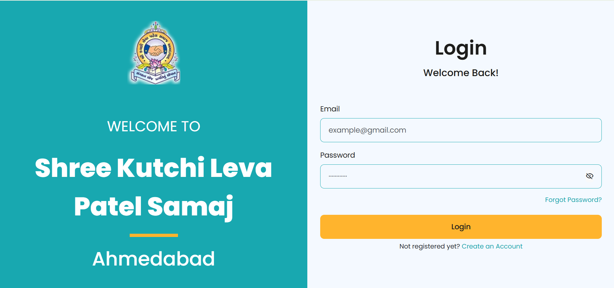
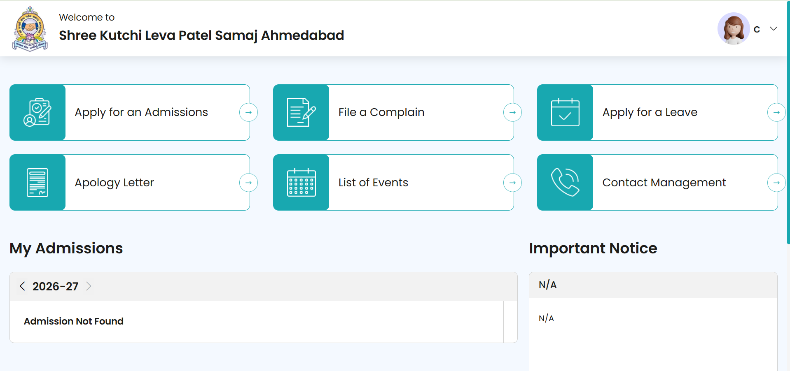

# Student Admission & Community Management System

A full-stack web application developed using Laravel and Tailwind CSS for managing student admissions, complaints, leave requests, and community-related operations through a centralized dashboard.

---

## Features

- Secure authentication system
- Student dashboard
- Multi-step admission form
- Complaint management
- Leave application system
- Event listing module
- Profile management
- Responsive user interface
- Form validation and secure data handling

---

## Technologies Used

- Laravel
- PHP
- MySQL
- Tailwind CSS
- Vite
- JavaScript

---

## System Modules

### Student Module
- Apply for admissions
- Submit complaints
- Apply for leave
- View events

### Administration Module
- Manage student applications
- Handle complaints
- Manage records
- Dashboard analytics

---

## Installation

Clone the repository:

```bash
git clone https://github.com/YOUR-USERNAME/student-management-system.git
```

Install dependencies:

```bash
composer install
npm install
```

Setup environment file:

```bash
cp .env.example .env
```

Generate application key:

```bash
php artisan key:generate
```

Run migrations:

```bash
php artisan migrate
```

Start development server:

```bash
php artisan serve
npm run dev
```

---

## Screenshots

### Login Page


### Student Dashboard


### Admission Form


---

## Future Improvements

- Email notifications
- Online document verification
- Role-based access control
- Analytics dashboard
- Multi-language support

---

## Author

Vanshi Hirani
